# Luồng Xử Lý AI Core v6.0 APEX - Phân Tích Hình Ảnh & Thông Tin Đặt Bàn

Hệ thống đặt bàn của **King's Grill** sử dụng động cơ **AI Core v6.0 APEX** (phiên bản cập nhật tháng 4/2026), tích hợp các kỹ thuật tối ưu hóa hiệu năng cao bao gồm: chạy song song mô hình (Race Mode), tự động sửa lỗi JSON (JSON Auto-Repair), nhận diện thực đơn mờ (Fuzzy Menu Matching) và vòng lặp tự học qua phản hồi của người dùng.

---

## 1. Sơ Đồ Luồng Xử Lý Tổng Quan (Mermaid Workflow)

```mermaid
flowchart TD
    %% Định nghĩa các lớp kiểu dáng
    classDef input fill:#e1f5fe,stroke:#03a9f4,stroke-width:2px;
    classDef process fill:#fff9c4,stroke:#fbc02d,stroke-width:2px;
    classDef ai fill:#ede7f6,stroke:#673ab7,stroke-width:2px;
    classDef logic fill:#e8f5e9,stroke:#4caf50,stroke-width:2px;
    classDef output fill:#ffe0b2,stroke:#ff9800,stroke-width:2px;

    %% Luồng Dữ Liệu Đầu Vào
    A[Nhân viên nhập thông tin đặt bàn] --> B{Đầu vào là gì?}
    class A input;
    class B process;

    %% Nhánh xử lý Hình ảnh (OCR)
    B -- Hình ảnh / Bill chụp --> C[Tối ưu hóa ảnh: Resize về 800px]
    C --> D[OCR Waterfall Mode: Thử lần lượt các mô hình Vision]
    D --> E[Trích xuất Văn bản thô]
    E --> F[Ghi văn bản thô vào Textarea & Xóa ảnh gốc]
    F --> G[Tiến hành Phân tích]
    class C,F,G process;
    class D ai;
    class E logic;

    %% Nhánh xử lý Text trực tiếp
    B -- Văn bản / OCR Text --> G
    
    %% Tiền xử lý văn bản
    G --> H[Layer 1: Tiền xử lý - Pre-normalization]
    H --> I[Chuẩn hóa khoảng cách: 20pax -> 20 pax]
    I --> J[Chuyển đổi ngày tương đối: hôm nay, ngày mai -> ngày cụ thể]
    J --> K[Áp dụng Từ điển chỉnh sửa tự học của Admin]
    class H,I,J,K logic;

    %% Bộ kiểm tra quy tắc cứng (Rule-Based Engine)
    K --> L[Rule-Based Engine V6.2: Trích xuất SĐT, ngày, giờ bằng Regex]
    L --> M{Có SĐT + Ngày & KHÔNG có món ăn?}
    M -- Đúng --> N[Bỏ qua LLM: Trả về kết quả ngay lập tức - Latency 0.0s]
    class L logic;
    class M process;
    class N output;

    %% Gọi API AI chính thức
    M -- Sai --> O{Kiểm tra Cache của hệ thống - 5 min TTL}
    O -- Có Cache --> P[Lấy ngay kết quả cũ - Latency 0.0s]
    O -- Chưa có Cache --> Q[Bắt đầu Smart Router V6.0]
    class O process;
    class P output;
    class Q ai;

    %% Smart Router Pipeline
    Q --> R{Cấu hình >= 2 model Tier <= 2?}
    R -- Đúng --> S[Race Mode: Chạy song song 2 model hàng đầu - m1 vs m2]
    S --> T{Có model nào trả về thành công trước?}
    T -- Đúng --> V[Chọn kết quả nhanh nhất]
    T -- Sai / Thất bại cả hai --> U[Waterfall Mode: Thử tuần tự từng model theo Tier]
    R -- Sai --> U
    class R,T process;
    class S,U,V ai;

    %% Sửa lỗi và Chuẩn hóa Schema
    V & U & N --> W{JSON trả về có đúng cú pháp?}
    W -- Lỗi cú pháp --> X[Auto-repair JSON: Dùng model nhanh nhất để sửa lỗi]
    W -- Hợp lệ --> Y[Dual-Schema Normalizer: Chuẩn hóa về Schema V5 chuẩn]
    X --> Y
    class W process;
    class X ai;
    class Y logic;

    %% So khớp Thực đơn
    Y --> Z[Layer 2: Đột phá định tuyến Thực đơn - Smart Menu Sheet Routing]
    Z --> AA{Khớp với Sheet thực đơn khác?}
    AA -- Khớp mấp mé --> AB[Hiển thị Modal hỏi ý kiến Nhân viên]
    AA -- Khớp rõ ràng --> AC[Tự động chuyển đổi sang Sheet thực đơn phù hợp]
    AA -- Không khớp --> AD[Giữ nguyên Thực đơn hiện tại]
    class Z logic;
    class AA process;
    class AB,AC,AD logic;

    %% Hậu xử lý & So khớp món ăn mờ
    AB & AC & AD --> AE[Layer 3: Hậu xử lý & So khớp món ăn mờ - Fuzzy Match]
    AE --> AF[So khớp 3 cấp độ: Exact -> Contains -> Word Overlap >= 50%]
    AF --> AG[Tự động điền mô tả combo/set thành phần vào ghi chú món ăn]
    AG --> AH[Tính toán điểm tin cậy Confidence Score & Cảnh báo trường cần xem xét]
    class AE,AF,AG,AH logic;

    %% Hiển thị và Vòng lặp Tự học
    AH --> AI[Áp dụng kết quả lên Form để nhân viên duyệt]
    AI --> AJ{Nhân viên chỉnh sửa trường nào trước khi bấm Lưu?}
    AJ -- Có thay đổi --> AK[Auto-Learn: Gọi API ghi nhận lỗi phân tích của AI]
    AJ -- Giữ nguyên --> AL[Hoàn tất đặt bàn]
    AK --> AL
    class AI output;
    class AJ process;
    class AK logic;
    class AL output;
```

---

## 2. Chi Tiết Các Bước Trong Luồng Xử Lý

### Bước 1: Tiếp nhận và Tiền xử lý (Input & OCR Layer)

1. **OCR Hình ảnh (Nếu đầu vào là hình ảnh bill chuyển khoản hoặc ảnh chụp tin nhắn):**
   * Tệp hình ảnh được tối ưu hóa bằng cách resize chiều rộng về **800px** (hoặc **1120px** nếu phân tích bill chuyển khoản trực tiếp) thông qua hàm `resizeImage` để tiết kiệm băng thông và tăng tốc độ xử lý của mô hình Vision.
   * Chạy **Waterfall OCR Mode**: Lọc danh sách các mô hình Vision đang được cấu hình (ví dụ: *Gemini 2.5 Flash, Llama 4 Scout, Mistral Small Vision*), sắp xếp theo Tier tốc độ (nhanh nhất chạy trước).
   * Gọi mô hình để trích xuất toàn bộ chữ viết tay, bảng biểu, ảnh chụp tin nhắn thành văn bản thô theo chỉ thị của `IMAGE_OCR_PROMPT` (giữ nguyên cấu trúc dòng, phân định rõ người gửi/người nhận).
   * Đưa văn bản thu được vào ô nhập liệu (`rawInput`) và xóa ảnh gốc khỏi bộ nhớ đệm để giải phóng tài nguyên.

2. **Tiền xử lý Văn bản thô (`preNormalize`):**
   * Chuẩn hóa dấu xuống dòng (`\r\n` thành `\n`), loại bỏ khoảng trống thừa.
   * Thêm khoảng trắng phân tách giữa các từ chỉ số lượng và đơn vị (ví dụ: `20pax` thành `20 pax`, `18h` thành `18 h`).
   * **Phân tích ngày tương đối:** Hệ thống tự động tính toán dựa trên ngày hiện tại của máy khách để thay thế các từ khóa như:
     * `"hôm nay"`, `"nay"`, `"tối nay"` $\rightarrow$ `"ngày DD/MM/YYYY"`
     * `"ngày mai"`, `"mai"` $\rightarrow$ `"ngày (DD+1)/MM/YYYY"`
     * `"mốt"`, `"ngày kia"` $\rightarrow$ `"ngày (DD+2)/MM/YYYY"`

3. **Áp dụng Từ điển Tự học (Admin Corrections):**
   * Duyệt qua danh sách `appStore.aiCorrections` (dữ liệu do hệ thống tự học từ các lần chỉnh sửa trước đó của nhân viên).
   * Nếu nội dung đầu vào khớp với cụm từ đã lưu trong từ điển, giá trị sửa đổi tương ứng sẽ được chuẩn bị sẵn để ghi đè sau khi AI hoàn tất phân tích.

---

### Bước 2: Bộ kiểm tra Quy tắc cứng & Pipeline AI (Smart Router)

1. **Bỏ qua AI nhờ Rule-Based Engine V6.2 (Bypass LLM):**
   * Trước khi gọi API AI tốn kém và mất thời gian, hệ thống chạy hàm `ruleBasedParse` sử dụng các biểu thức chính quy (Regex) để trích xuất nhanh thông tin đặt bàn cơ bản:
     * *Số điện thoại:* Kiểm tra định dạng đầu số di động Việt Nam.
     * *Giờ tiệc:* Nhận diện định dạng `HH:mm` hoặc `HHh`.
     * *Số khách (Pax):* Trích xuất số lượng đi kèm từ khóa "pax/người/khách".
   * **Điều kiện Bypass:** Nếu tin nhắn đầu vào có chứa Số điện thoại + Ngày tiệc rõ ràng và **không chứa tên món ăn** nào có trong thực đơn, hệ thống sẽ bỏ qua việc gọi AI. Thay vào đó, nó lập tức xuất dữ liệu dạng Rule-Based với độ trễ (latency) bằng **0.0 giây**.

2. **Kiểm tra Cache cục bộ:**
   * Nếu phải gọi AI, hệ thống kiểm tra bộ nhớ đệm Cache (TTL 5 phút, tối đa 20 bản ghi gần nhất). Nếu trùng khớp nội dung đầu vào, kết quả được trả về ngay lập tức.

3. **Smart Router V6.0 - Race Mode & Waterfall:**
   * **Race Mode (Đua tốc độ):** Nếu có ít nhất 2 mô hình cao cấp (Tier $\le$ 2) được cấu hình khóa API, hệ thống sẽ kích hoạt chạy song song đồng thời cả hai mô hình (ví dụ: *Llama 3.3 70B trên Groq* đấu với *Llama 3.3 70B trên Cerebras*). Mô hình nào trả về dữ liệu JSON hợp lệ trước sẽ thắng cuộc và được sử dụng, mô hình còn lại bị hủy yêu cầu. Điều này giúp giảm độ trễ xuống mức tối thiểu (dưới 1 giây).
   * **Waterfall Mode (Thác đổ):** Nếu Race Mode thất bại hoặc chỉ có 1 mô hình chính được cấu hình, hệ thống sẽ gọi tuần tự từng mô hình từ tốc độ cao xuống thấp làm phương án dự phòng.

4. **Tự động sửa lỗi JSON (JSON Auto-Repair):**
   * Nếu mô hình trả về chuỗi JSON bị lỗi cú pháp (do đứt dòng hoặc phản hồi kèm chữ thừa), hệ thống sẽ kích hoạt hàm `repairJSON`.
   * Một mô hình text siêu nhanh sẽ được gọi riêng với nhiệm vụ duy nhất: *"Fix broken JSON"* để đảm bảo không bị lỗi giao diện phía client.

5. **Chuẩn hóa Dual-Schema:**
   * Dữ liệu trả về từ AI được chuyển qua bộ lọc `normalizeAIResponse` để đồng bộ cấu trúc Schema cũ (Legacy Flat) và mới (V5 Nested) thành định dạng chuẩn hóa thống nhất trước khi hậu xử lý.

---

### Bước 3: Hậu xử lý & So khớp Thực đơn (Post-processing)

1. **Smart Menu Sheet Routing (Định tuyến Thực đơn):**
   * Hệ thống tính toán độ tương thích của nội dung đặt bàn với các Sheet thực đơn hiện có (ví dụ: Tiệc cưới, Sinh nhật, Thực đơn thường) dựa trên:
     * Từ khóa xuất hiện trong tin nhắn (ví dụ: từ "cưới" cộng điểm cho Sheet tiệc cưới).
     * Số lượng món ăn khớp với danh sách món có trong từng Sheet.
   * Nếu phát hiện thực đơn tối ưu khác thực đơn hiện tại:
     * **Khớp mấp mé (Borderline):** Hiển thị hộp thoại hỏi nhân viên: *"Hệ thống nhận diện bạn đang dùng thực đơn X. Bạn có muốn đổi sang thực đơn này không?"*.
     * **Khớp rõ ràng:** Tự động chuyển đổi Sheet thực đơn hoạt động và báo Toast thành công.

2. **So khớp món ăn mờ (Fuzzy Menu Matching - 3 Cấp độ):**
   * Đối với danh sách món khách gọi, hệ thống chạy thuật toán so khớp mờ với thực đơn hoạt động:
     * **Cấp độ 1 (Khớp tuyệt đối):** So khớp chính xác tên đã lọc dấu hoặc ký hiệu viết tắt (Acronym, ví dụ: "BNT" $\rightarrow$ "Bò nướng tảng").
     * **Cấp độ 2 (Khớp chứa đựng):** Tên món nhập vào nằm trong tên món thực đơn hoặc ngược lại (ví dụ: "ba chỉ bò" $\rightarrow$ "Ba chỉ bò Mỹ nướng").
     * **Cấp độ 3 (Khớp chồng từ - Word Overlap):** Phân rã từ ngữ và chấm điểm trùng lặp. Nếu tỷ lệ trùng lặp $\ge 50\%$, hệ thống sẽ tự động bắt cặp (ví dụ: "ba chỉ heo" $\rightarrow$ "ba chỉ heo nướng bản gang").
   * **Xử lý món Set/Combo:** Nếu món ăn khớp là một Set hoặc Combo, hệ thống tự động tìm cột mô tả món con (Description) và dùng hàm `formatSetNote` chuyển đổi danh sách món con thành chuỗi mô tả chi tiết điền vào ghi chú món ăn cho nhân viên tiện theo dõi.
   * **Món không tìm thấy:** Giá tiền tự động đưa về 0đ và cảnh báo hiển thị trong danh sách `unresolved_items` để nhân viên tự kiểm tra thủ công.

3. **Tính toán Điểm tin cậy (Confidence Score):**
   * So sánh kết quả AI trích xuất với kết quả của động cơ Rule-Based cục bộ để chấm điểm phần trăm tin cậy của từng trường thông tin (Tên khách, SĐT, Ngày, Giờ, Số khách, Số bàn).
   * Bất kỳ trường nào có độ tin cậy thấp hoặc định dạng không đúng chuẩn sẽ bị gắn cờ `needs_review: true`.

---

### Bước 4: Áp dụng vào Phiếu & Cơ chế Tự học (Self-Learning Loop)

1. **Hiển thị Panel Xác Nhận (AI Review Card):**
   * Giao diện hiển thị các ô thông tin đã phân tích.
   * Các trường bị gắn cờ cảnh báo nghi ngờ sai lệch (ví dụ: SĐT thiếu số, ngày tổ chức không hợp lệ) sẽ được **tô viền vàng nhấp nháy** để nhân viên tập trung kiểm tra.
   * Nhân viên nhấn **"ÁP DỤNG VÀO PHIẾU"** để điền toàn bộ dữ liệu vào Form đặt bàn chính.

2. **Cơ chế Tự học khi Lưu đặt bàn (`checkAndLogAiCorrections`):**
   * Khi nhân viên nhấn lưu phiếu đặt bàn, hệ thống so sánh giá trị cuối cùng trên Form với giá trị ban đầu do AI phân tích ra (`originalAiValues`).
   * Nếu phát hiện nhân viên có chỉnh sửa thủ công do AI nhận diện sai (ví dụ: AI nhận diện tên là "Hôm Nay" nhưng nhân viên sửa thành "Anh Hùng"), hệ thống lập tức gọi API `logAiCorrection` gửi dữ liệu chỉnh sửa này về cơ sở dữ liệu.
   * Lần phân tích sau, nếu gặp cụm từ tương tự, Layer tiền xử lý sẽ tự động áp dụng giá trị sửa đổi chính xác này mà không phụ thuộc vào LLM nữa.
