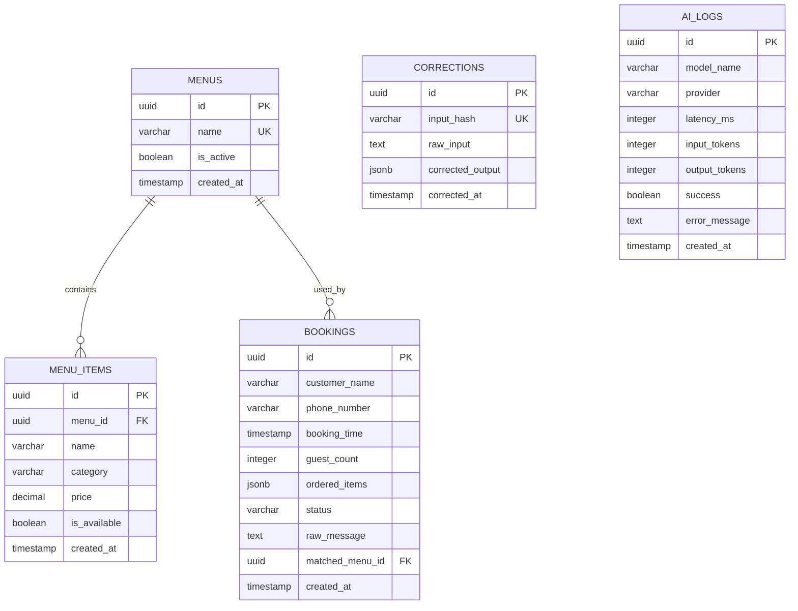

# Kế hoạch Di chuyển Backend & Thiết kế Cơ sở dữ liệu (BACKEND_MIGRATION_PLAN.md)

Tài liệu này trình bày kế hoạch di chuyển hệ thống cơ sở dữ liệu và logic backend của ứng dụng `kg-booking` từ giải pháp lưu trữ tạm thời (**Google Sheets + Google Apps Script**) sang hệ quản trị cơ sở dữ liệu quan hệ chuyên nghiệp **PostgreSQL** (khuyến nghị lưu trữ trên **Supabase** hoặc **Neon**) để tối ưu hóa hiệu năng, độ trễ (latency), loại bỏ giới hạn quota và hỗ trợ các tính năng phân tích nâng cao.

---

## 1. Bối cảnh & Lý do di chuyển
- **Độ trễ cao (Latency)**: Các truy vấn thông qua Google Apps Script Web App và Google Sheets API thường mất từ 1.5 - 4 giây do overhead kết nối và cơ chế ghi/đọc dạng file spreadsheet.
- **Giới hạn Quota**: Google Sheets giới hạn số lượng dòng (tối đa 10 triệu ô) và GAS giới hạn tần suất gọi API hàng ngày cũng như thời gian thực thi tối đa (6 phút/request).
- **Thiếu Ràng buộc Toàn vẹn (Integrity Constraints)**: Không hỗ trợ khóa ngoại, giao dịch (transactions), kiểm tra kiểu dữ liệu tự động, dễ dẫn đến lỗi không đồng nhất dữ liệu khi nhiều người dùng thao tác cùng lúc.

---

## 2. Thiết kế Cơ sở dữ liệu Quan hệ (PostgreSQL)

Dưới đây là thiết kế Schema chi tiết cho các thực thể cốt lõi: Đơn đặt bàn (bookings), Thực đơn (menus/items), Sửa lỗi AI (corrections) và Nhật ký hệ thống (ai_logs).



### 2.1. DDL chi tiết (SQL)

```sql
-- Kích hoạt extension hỗ trợ sinh UUID tự động
CREATE EXTENSION IF NOT EXISTS "uuid-ossp";

-- 1. Bảng Thực đơn (Menus)
CREATE TABLE menus (
    id UUID PRIMARY KEY DEFAULT uuid_generate_v4(),
    name VARCHAR(100) NOT NULL UNIQUE,
    is_active BOOLEAN DEFAULT TRUE,
    created_at TIMESTAMP WITH TIME ZONE DEFAULT CURRENT_TIMESTAMP,
    updated_at TIMESTAMP WITH TIME ZONE DEFAULT CURRENT_TIMESTAMP
);

-- 2. Bảng Món ăn trong thực đơn (Menu Items)
CREATE TABLE menu_items (
    id UUID PRIMARY KEY DEFAULT uuid_generate_v4(),
    menu_id UUID NOT NULL REFERENCES menus(id) ON DELETE CASCADE,
    name VARCHAR(255) NOT NULL,
    category VARCHAR(100),
    price DECIMAL(12, 2) NOT NULL DEFAULT 0.00,
    is_available BOOLEAN DEFAULT TRUE,
    created_at TIMESTAMP WITH TIME ZONE DEFAULT CURRENT_TIMESTAMP,
    updated_at TIMESTAMP WITH TIME ZONE DEFAULT CURRENT_TIMESTAMP,
    UNIQUE(menu_id, name) -- Tránh trùng tên món trong cùng một thực đơn
);

-- 3. Bảng Đơn đặt bàn (Bookings)
CREATE TABLE bookings (
    id UUID PRIMARY KEY DEFAULT uuid_generate_v4(),
    customer_name VARCHAR(150) NOT NULL,
    phone_number VARCHAR(20) NOT NULL,
    booking_time TIMESTAMP WITH TIME ZONE NOT NULL,
    guest_count INT NOT NULL CHECK (guest_count > 0),
    ordered_items JSONB DEFAULT '[]'::jsonb, -- Cấu trúc: [{"name": "Món A", "qty": 2, "price": 100000}]
    status VARCHAR(50) DEFAULT 'pending', -- pending, confirmed, cancelled, seated
    raw_message TEXT, -- Tin nhắn thô nhận từ khách hàng
    matched_menu_id UUID REFERENCES menus(id) ON DELETE SET NULL,
    created_at TIMESTAMP WITH TIME ZONE DEFAULT CURRENT_TIMESTAMP,
    updated_at TIMESTAMP WITH TIME ZONE DEFAULT CURRENT_TIMESTAMP
);

-- 4. Bảng Sửa lỗi AI (Corrections)
CREATE TABLE corrections (
    id UUID PRIMARY KEY DEFAULT uuid_generate_v4(),
    input_hash VARCHAR(64) UNIQUE NOT NULL, -- SHA-256 hash của tin nhắn thô để tìm kiếm nhanh
    raw_input TEXT NOT NULL,
    corrected_output JSONB NOT NULL, -- Dữ liệu JSON đã được con người chỉnh sửa lại chuẩn xác
    corrected_at TIMESTAMP WITH TIME ZONE DEFAULT CURRENT_TIMESTAMP
);

-- 5. Bảng Nhật ký AI (AI Logs)
CREATE TABLE ai_logs (
    id UUID PRIMARY KEY DEFAULT uuid_generate_v4(),
    model_name VARCHAR(100) NOT NULL,
    provider VARCHAR(50) NOT NULL,
    latency_ms INT NOT NULL,
    input_tokens INT,
    output_tokens INT,
    success BOOLEAN NOT NULL DEFAULT TRUE,
    error_message TEXT,
    created_at TIMESTAMP WITH TIME ZONE DEFAULT CURRENT_TIMESTAMP
);
```

---

## 3. Thiết kế Chỉ mục (Composite & Functional Indexes)

Để tăng tốc độ tìm kiếm và khớp dữ liệu ở mức mili-giây (miliseconds), các chỉ mục sau đây bắt buộc phải được thiết lập:

### 3.1. Khớp món ăn không phân biệt chữ hoa/chữ thường:
Khi thực hiện fuzzy match ở phía backend, việc đối chiếu tên món ăn rất thường xuyên. Sử dụng chỉ mục hàm `LOWER` giúp tối ưu hóa:
```sql
CREATE INDEX idx_menu_items_name_lower ON menu_items (menu_id, LOWER(name));
```

### 3.2. Truy vấn đặt bàn theo số điện thoại và thời gian:
Giúp nhân viên nhà hàng tìm kiếm nhanh lịch sử đặt bàn của khách khi họ gọi điện đến:
```sql
CREATE INDEX idx_bookings_phone_time ON bookings (phone_number, booking_time DESC);
```

### 3.3. Truy xuất nhật ký sửa lỗi AI bằng hash:
Khi có tin nhắn mới, hệ thống sẽ băm SHA-256 tin nhắn đó và tra cứu ngay trong bảng `corrections` để tìm kết quả sửa lỗi cũ. Chỉ mục duy nhất (Unique Index) tự động được tạo bởi khóa `UNIQUE(input_hash)`, tuy nhiên ta bổ sung thêm chỉ mục phục vụ thống kê:
```sql
CREATE INDEX idx_corrections_hash ON corrections (input_hash);
```

### 3.4. Giám sát hiệu năng AI:
Giúp thống kê tốc độ trung bình và tỷ lệ lỗi của các model theo thời gian:
```sql
CREATE INDEX idx_ai_logs_perf ON ai_logs (model_name, created_at DESC) WHERE success = false;
```

---

## 4. Chiến lược Di chuyển & Chạy song song (Dual-Read/Write)

Để đảm bảo quá trình di chuyển cơ sở dữ liệu diễn ra êm đẹp, không gây gián đoạn hoạt động của nhà hàng (Zero Downtime), chúng tôi đề xuất chiến lược 3 giai đoạn:

```
[Giai đoạn 1: Dual-Write / Single-Read]
   Frontend (Vue) ----> API Server ----> Write to PostgreSQL
                                   ----> Write to Google Sheets (GAS)
                      ----> Read from PostgreSQL (Chính) / Fallback to Sheets (Phụ)

[Giai đoạn 2: Kiểm chứng và Đồng bộ dữ liệu]
   Chạy tool đối chiếu dữ liệu (Reconciliation Script) hàng đêm để so khớp sai lệch giữa Sheets và DB.

[Giai đoạn 3: Cutover]
   Ngắt kết nối ghi sang Google Sheets, chuyển Sheets về chế độ chỉ đọc (Archived). 
   Hệ thống chạy 100% trên PostgreSQL.
```

### Chi tiết kỹ thuật Giai đoạn 1 (Dual-Write):
1. **Thiết lập Feature Flag**: Thêm biến cấu hình `VITE_DB_MODE` nhận giá trị `sheets`, `dual`, hoặc `postgres`.
2. **Triển khai ở Repository Layer**:
   ```typescript
   class BookingRepository {
     async create(booking: Booking): Promise<Booking> {
       if (config.DB_MODE === 'postgres') {
         return await pgClient.insert(booking);
       } else if (config.DB_MODE === 'sheets') {
         return await gasClient.insert(booking);
       } else if (config.DB_MODE === 'dual') {
         // Ghi song song
         const [pgResult, gasResult] = await Promise.allSettled([
           pgClient.insert(booking),
           gasClient.insert(booking)
         ]);
         
         if (pgResult.status === 'fulfilled') {
           return pgResult.value;
         } else {
           // Fallback ghi lỗi
           logger.error('PG Write failed, fallback to Sheets only', pgResult.reason);
           return (gasResult as PromiseFulfilledResult<Booking>).value;
         }
       }
     }
   }
   ```

---

## 5. Kế hoạch Dự phòng & Khôi phục (Rollback Plan)

Trong trường hợp hệ thống mới gặp sự cố nghiêm trọng sau khi triển khai (ví dụ: Database PostgreSQL bị sập, API Server chịu tải kém, lỗi rò rỉ kết nối):

### 5.1. Kịch bản lỗi và Quy trình Rollback tương ứng:

#### Kịch bản A: Lỗi kết nối PostgreSQL tăng cao đột biến (Database Connection Timeout)
- **Hành động**: Đổi Feature Flag `VITE_DB_MODE` từ `postgres` hoặc `dual` về lại `sheets`.
- **Thời gian thực hiện**: < 1 phút (thông qua cập nhật file `.env` trên Hosting Frontend/Vercel/Cloudflare Pages).
- **Kết quả**: Ứng dụng Vue sẽ tự động bỏ qua API Server mới và gọi trực tiếp vào Google Apps Script cũ, nhà hàng tiếp tục hoạt động bình thường.

#### Kịch bản B: Dữ liệu ghi song song bị lệch (Data Desynchronization)
- **Hành động**: Sử dụng bản sao dữ liệu tại Google Sheets (vì luôn được ghi song song ở chế độ `dual`) làm nguồn dữ liệu chuẩn để đồng bộ ngược lại PostgreSQL.
- **Quy trình xử lý**:
  1. Chuyển `VITE_DB_MODE` về `sheets` tạm thời.
  2. Chạy script đồng bộ: Đọc dữ liệu từ Google Sheets -> Lọc các dòng chưa có UUID trong PostgreSQL -> Ghi đè/Bổ sung vào PostgreSQL.
  3. Khắc phục lỗi hệ thống PostgreSQL và chuyển lại chế độ `postgres`.

---

## 6. Lộ trình thực hiện cụ thể

1. **Tuần 1: Thiết lập Database & Viết DDL**: Tạo cơ sở dữ liệu trên Supabase, chạy mã tạo bảng và thiết lập chỉ mục.
2. **Tuần 2: Xây dựng API Server / Workers**: Viết lớp REST API kết nối PostgreSQL.
3. **Tuần 3: Đồng bộ dữ liệu cũ**: Viết script ETL tải toàn bộ dữ liệu lịch sử đặt bàn và món ăn hiện tại từ Google Sheets nạp vào PostgreSQL.
4. **Tuần 4: Triển khai Dual-Write & Test**: Phát hành bản cập nhật Frontend với chế độ `dual-write`, kiểm tra đối chiếu dữ liệu sau 1 tuần.
5. **Tuần 5: Hoàn tất chuyển đổi**: Đổi cấu hình sang chạy 100% PostgreSQL.
