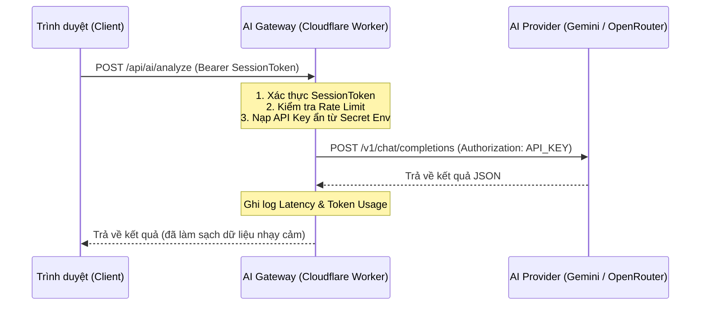

# Lộ trình Bảo mật & Thiết kế AI Gateway (SECURITY_ROADMAP.md)

Tài liệu này trình bày chi tiết kế hoạch thiết kế và triển khai **AI Gateway Proxy** sử dụng **Cloudflare Workers** nhằm bảo vệ API Keys của hệ thống `kg-booking`, cấu hình chính sách bảo mật Client-Side, phân quyền người dùng (RBAC) và quản lý phiên làm việc.

---

## 1. Mục tiêu Bảo mật (Security Objectives)
- **Bảo vệ thông tin đăng nhập**: Tuyệt đối không lưu trữ hoặc truyền tải API Keys của các nhà cung cấp AI (Google Gemini, OpenRouter, OpenAI, v.v.) dưới dạng plain-text ở phía Client (Frontend).
- **Phòng chống lạm dụng (Rate Limiting)**: Thiết lập giới hạn tần suất gọi API trên mỗi IP / User Session nhằm ngăn chặn tấn công DDoS hoặc lạm dụng làm cạn kiệt Quota API.
- **Ghi nhật ký bảo mật (Audit Logging)**: Lưu trữ và giám sát các yêu cầu gọi AI (AI Request Logs) bao gồm: IP nguồn, model sử dụng, token tiêu hao và thời gian xử lý mà không làm rò rỉ dữ liệu nhạy cảm của khách hàng.
- **Bảo vệ cấu hình hệ thống**: Ngăn chặn người dùng không có thẩm quyền truy cập và sửa đổi cài đặt hệ thống.

---

## 2. Kiến trúc AI Gateway với Cloudflare Workers
Thay vì gọi trực tiếp các API của Google Gemini/OpenRouter từ trình duyệt của người dùng, toàn bộ yêu cầu phân tích AI sẽ được định tuyến thông qua một Cloudflare Worker hoạt động như một Reverse Proxy.



### Ưu điểm của Cloudflare Workers:
- **Thời gian phản hồi siêu nhanh (Ultra-low Latency)**: Chạy trên mạng lưới toàn cầu của Cloudflare (Edge Network), triệt tiêu độ trễ khởi động lạnh (cold start) so với Google Apps Script.
- **Bảo mật Secret**: API Keys được lưu trữ an toàn trong biến môi trường mã hóa của Cloudflare (`wrangler secret`).
- **Chi phí tối ưu**: Hỗ trợ 1 triệu requests miễn phí mỗi ngày.

---

## 3. Triển khai Cloudflare Worker Proxy (Mã nguồn minh họa)

Dưới đây là mã nguồn đề xuất cho Cloudflare Worker (`index.ts` hoặc `worker.js`) đảm nhiệm vai trò AI Gateway:

```typescript
export interface Env {
  GEMINI_API_KEY: string;
  OPENROUTER_API_KEY: string;
  APP_SHARED_SECRET: string; // Khóa chia sẻ để xác thực Client
}

export default {
  async fetch(request: Request, env: Env, ctx: ExecutionContext): Promise<Response> {
    // 1. Cấu hình CORS Headers
    const corsHeaders = {
      "Access-Control-Allow-Origin": "*", // Thay bằng domain chính thức khi production
      "Access-Control-Allow-Methods": "POST, OPTIONS",
      "Access-Control-Allow-Headers": "Content-Type, Authorization",
    };

    if (request.method === "OPTIONS") {
      return new Response(null, { headers: corsHeaders });
    }

    if (request.method !== "POST") {
      return new Response(JSON.stringify({ ok: false, error: "Method not allowed" }), {
        status: 405,
        headers: { ...corsHeaders, "Content-Type": "application/json" }
      });
    }

    try {
      const url = new URL(request.url);
      
      // 2. Xác thực Client Token
      const authHeader = request.headers.get("Authorization");
      if (!authHeader || !authHeader.startsWith("Bearer ") || authHeader.split(" ")[1] !== env.APP_SHARED_SECRET) {
        return new Response(JSON.stringify({ ok: false, error: "Unauthorized: Invalid App Secret Token" }), {
          status: 401,
          headers: { ...corsHeaders, "Content-Type": "application/json" }
        });
      }

      // 3. Phân tích Payload nhận từ Frontend
      const payload = await request.json() as any;
      const { model, provider, sysPrompt, userPrompt, image, jsonMode } = payload;

      if (!sysPrompt || !userPrompt) {
        return new Response(JSON.stringify({ ok: false, error: "Missing required prompts" }), {
          status: 400,
          headers: { ...corsHeaders, "Content-Type": "application/json" }
        });
      }

      // 4. Chọn API Key tương ứng dựa trên Provider
      let apiKey = "";
      let targetUrl = "";
      let headers: Record<string, string> = { "Content-Type": "application/json" };
      let body: any = {};

      if (provider === "google") {
        apiKey = env.GEMINI_API_KEY;
        targetUrl = `https://generativelanguage.googleapis.com/v1beta/models/${model}:generateContent?key=${apiKey}`;
        body = {
          contents: [{
            parts: [
              { text: sysPrompt + "\n\nUser Input:\n" + userPrompt },
              ...(image ? [{ inline_data: { mime_type: "image/jpeg", data: image.split(",")[1] } }] : [])
            ]
          }],
          generationConfig: {
            temperature: 0.1,
            ...(jsonMode ? { responseMimeType: "application/json" } : {})
          }
        };
      } else if (provider === "openrouter") {
        apiKey = env.OPENROUTER_API_KEY;
        targetUrl = "https://openrouter.ai/api/v1/chat/completions";
        headers["Authorization"] = `Bearer ${apiKey}`;
        headers["HTTP-Referer"] = "https://kings-grill-booking.pages.dev";
        headers["X-Title"] = "KING'S GRILL BOOKING APP";
        
        let msgContent: any = userPrompt;
        if (image) {
          msgContent = [
            { type: "text", text: userPrompt },
            { type: "image_url", image_url: { url: image } }
          ];
        }

        body = {
          model: model,
          messages: [
            { role: "system", content: sysPrompt },
            { role: "user", content: msgContent }
          ],
          temperature: 0.1,
          ...(jsonMode ? { response_format: { type: "json_object" } } : {})
        };
      } else {
        return new Response(JSON.stringify({ ok: false, error: `Unsupported provider: ${provider}` }), {
          status: 400,
          headers: { ...corsHeaders, "Content-Type": "application/json" }
        });
      }

      // 5. Gửi request đến AI Provider với Timeout (20 giây)
      const controller = new AbortController();
      const timeoutId = setTimeout(() => controller.abort(), 20000);

      const aiResponse = await fetch(targetUrl, {
        method: "POST",
        headers,
        body: JSON.stringify(body),
        signal: controller.signal
      });
      clearTimeout(timeoutId);

      if (!aiResponse.ok) {
        const errText = await aiResponse.text();
        return new Response(JSON.stringify({ ok: false, error: `AI Provider Error: ${errText.substring(0, 150)}` }), {
          status: aiResponse.status,
          headers: { ...corsHeaders, "Content-Type": "application/json" }
        });
      }

      const resJson = await aiResponse.json() as any;
      let aiContent = "";

      if (provider === "google") {
        const parts = resJson.candidates?.[0]?.content?.parts || [];
        aiContent = parts.find((p: any) => p.text)?.text || "";
      } else {
        aiContent = resJson.choices?.[0]?.message?.content || "";
      }

      return new Response(JSON.stringify({ ok: true, content: aiContent }), {
        status: 200,
        headers: { ...corsHeaders, "Content-Type": "application/json" }
      });

    } catch (err: any) {
      return new Response(JSON.stringify({ ok: false, error: err.name === "AbortError" ? "Gateway Timeout (20s)" : err.message }), {
        status: 500,
        headers: { ...corsHeaders, "Content-Type": "application/json" }
      });
    }
  }
};
```

---

## 4. Quản lý Secret Keys & Masking trên UI

Hiện tại hệ thống hỗ trợ nhập API Key trực tiếp trên trang cấu hình (cho mục đích chạy độc lập hoặc debug). Để đảm bảo các API Keys này không bị chụp màn hình hoặc rò rỉ:

### 4.1. Quy tắc Masking API Key trên UI:
- Khi hiển thị danh sách API Key trong `Settings.vue` hoặc `TestDashboard.vue`, toàn bộ chuỗi ký tự phải được che giấu, chỉ để lại 4 ký tự đầu và 4 ký tự cuối.
- Ví dụ: `AIzaSy...4F7a` hoặc `sk-or-v1-...w1eD`.
- Helper che giấu khóa:
  ```typescript
  export function maskApiKey(key: string): string {
    if (!key) return '';
    if (key.length <= 8) return '••••••••';
    return `${key.substring(0, 4)}••••••••${key.substring(key.length - 4)}`;
  }
  ```

### 4.2. Mã hóa trước khi lưu LocalStorage/IndexedDB:
- Nếu lưu trữ API Key tạm thời dưới client để phục vụ chế độ "Direct Mode", toàn bộ API Key phải được mã hóa đối xứng (ví dụ sử dụng AES đơn giản hoặc Base64 + XOR Cipher với một chuỗi muối động lấy từ session) để tránh các script độc hại (XSS) đọc trộm từ `localStorage`.

---

## 5. Phân quyền Người dùng & Kiểm soát Truy cập (RBAC)

Hệ thống phân biệt hai cấp độ người dùng để giới hạn quyền truy cập vào các chức năng nhạy cảm:

| Quyền hạn | Nhân viên (Operator/Staff) | Quản trị viên (Admin) |
| :--- | :---: | :---: |
| Phân tích Đặt bàn bằng AI | ✅ | ✅ |
| Xem lịch sử đặt bàn | ✅ | ✅ |
| Xem danh mục Thực đơn / Menu | ✅ | ✅ |
| Cập nhật Dữ liệu Menu | ❌ | ✅ |
| Quản lý API Keys hệ thống | ❌ | ✅ |
| Thay đổi Model AI sử dụng | ❌ | ✅ |
| Xóa dữ liệu lịch sử / logs | ❌ | ✅ |

### Triển khai Bảo vệ Route trong Vue Router:
1. Gán thuộc tính `meta.requiresAdmin` trên các route nhạy cảm (ví dụ `/settings`).
2. Triển khai Router Navigation Guard:
   ```typescript
   router.beforeEach((to, from, next) => {
     const authStore = useAuthStore(); // Chứa thông tin user role
     if (to.matched.some(record => record.meta.requiresAdmin)) {
       if (!authStore.isAdmin) {
         next({ name: 'Dashboard', query: { error: 'permission-denied' } });
         return;
       }
     }
     next();
   });
   ```

---

## 6. Quản lý Phiên làm việc & Session Timeout
Để tránh việc bỏ quên màn hình thiết bị đang đăng nhập tại nhà hàng:
- **Thời gian hết hạn phiên mặc định**: 30 phút không hoạt động (Inactivity Timeout).
- **Cơ chế phát hiện hoạt động**: Lắng nghe các sự kiện `mousemove`, `keypress`, `mousedown`, `touchstart` trên tài liệu. Mỗi khi sự kiện kích hoạt, bộ đếm thời gian sẽ được reset.
- **Khi hết hạn**:
  1. Xóa sạch thông tin đăng nhập trong Store.
  2. Xóa các token tạm thời trong bộ nhớ cache.
  3. Định tuyến người dùng về trang đăng nhập (`/login`) và hiển thị thông báo: *"Phiên làm việc đã hết hạn do lâu không hoạt động. Vui lòng đăng nhập lại."*

---

## 7. Kế hoạch Triển khai (Roadmap)

### Pha 1: Chuẩn bị & Masking UI (Ngay lập tức)
- Triển khai UI masking cho tất cả các input chứa API Key trong ứng dụng Vue.
- Cấu hình Environment Variable `VITE_AI_MODE=direct` làm mặc định và chuẩn bị biến `VITE_AI_GATEWAY_URL`.

### Pha 2: Triển khai Cloudflare Workers (Tuần 1)
- Tạo project Worker trên Cloudflare Dash, đặt tên `kg-booking-ai-gateway`.
- Cấu hình các secret keys (`wrangler secret put GEMINI_API_KEY`).
- Deploy code proxy và kiểm thử luồng gọi AI từ Postman/Client.

### Pha 3: Chuyển đổi sang Gateway Mode (Tuần 2)
- Cập nhật cấu hình trong ứng dụng Vue: Chuyển `VITE_AI_MODE` sang `gateway`.
- Triển khai phân quyền Route `/settings` và cơ chế Session Timeout 30 phút.
- Kiểm thử tích hợp toàn diện (E2E) trên môi trường Staging.
