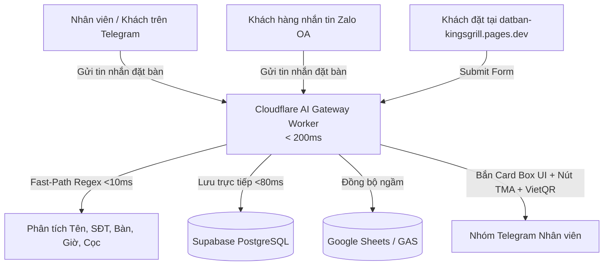

# HƯỚNG DẪN CẤU HÌNH & VẬN HÀNH TELEGRAM VÀ ZALO BOT
## KING'S GRILL — HỆ THỐNG ĐẶT BÀN & QUẢN TRỊ TỰ ĐỘNG

> **Phiên bản:** 2.5.0-APEX  
> **Cập nhật lần cuối:** 17/09/2026  
> **Hạ tầng phục vụ:** Cloudflare Edge Workers (`< 200ms`) & Google Apps Script (Backup)

---

## MỤC LỤC
1. [Tổng quan hệ sinh thái Bot](#1-tổng-quan-hệ-sinh-thái-bot)
2. [Cấu hình Telegram Bot từ A - Z](#2-cấu-hình-telegram-bot-từ-a---z)
   - [Bước 1: Tạo Bot & lấy Token qua @BotFather](#bước-1-tạo-bot--lấy-token-qua-botfather)
   - [Bước 2: Tạo Nhóm quản lý & lấy Chat ID](#bước-2-tạo-nhóm-quản-lý--lấy-chat-id)
   - [Bước 3: Trỏ Webhook sang Cloudflare AI Gateway (<200ms)](#bước-3-trỏ-webhook-sang-cloudflare-ai-gateway-200ms)
   - [Bước 4: Thiết lập Menu Lệnh & Quyền quản trị](#bước-4-thiết-lập-menu-lệnh--quyền-quản-trị)
   - [Bước 5: Kịch bản thử nghiệm thực tế](#bước-5-kịch-bản-thử-nghiệm-thực-tế)
3. [Cấu hình Zalo Bot (Zalo Official Account)](#3-cấu-hình-zalo-bot-zalo-official-account)
   - [Bước 1: Chuẩn bị Zalo OA & Tài khoản Nhà phát triển](#bước-1-chuẩn-bị-zalo-oa--tài-khoản-nhà-phát-triển)
   - [Bước 2: Đăng ký Webhook Zalo OA](#bước-2-đăng-ký-webhook-zalo-oa)
   - [Bước 3: Cấp quyền Webhook sự kiện tin nhắn](#bước-3-cấp-quyền-webhook-sự-kiện-tin-nhắn)
4. [Cấu hình trên Giao diện Quản trị Webapp King's Grill](#4-cấu-hình-trên-giao-diện-quản-trị-webapp-kings-grill)
5. [Cấu hình Biến Môi trường Cloudflare Worker (Nếu cần)](#5-cấu-hình-biến-môi-trường-cloudflare-worker-nếu-cần)
6. [Khắc phục sự cố thường gặp (Troubleshooting)](#6-khắc-phục-sự-cố-thường-gặp-troubleshooting)

---

## 1. TỔNG QUAN HỆ SINH THÁI BOT

Hệ thống Bot King's Grill vận hành đồng bộ trên đa nền tảng:
- **Telegram Bot:** Dành cho nội bộ nhân viên, quản lý ca và tiếp nhận thông báo đặt bàn tức thì.
- **Telegram Mini App (TMA):** Cho phép chạm nút mở thẳng Webapp đặt bàn 2D ([`datban-kingsgrill.pages.dev`](https://datban-kingsgrill.pages.dev)) ngay trong Telegram.
- **Zalo OA Bot:** Tiếp nhận tin nhắn đặt bàn của khách hàng từ Zalo, tự động bóc tách và đẩy về nhóm Telegram của nhân viên.
- **VietQR Napas Động:** Tự động tính tiền cọc và sinh ảnh QR kèm số tài khoản nhà hàng để quét thanh toán chính xác 100%.



---

## 2. CẤU HÌNH TELEGRAM BOT TỪ A - Z

### Bước 1: Tạo Bot & lấy Token qua @BotFather
1. Mở ứng dụng Telegram, tìm kiếm tài khoản chính thức: **`@BotFather`** (có dấu tích xanh).
2. Gõ lệnh: `/newbot`.
3. Nhập tên hiển thị cho Bot, ví dụ: `King's Grill Booking Assistant`.
4. Nhập username cho Bot (phải kết thúc bằng chữ `bot`), ví dụ: `KingsGrill_Booking_Bot`.
5. `@BotFather` sẽ trả về **HTTP API Token** có dạng:
   ```text
   7123456789:AAFlkjhsdf897sdfkjhsdf-ksjdfh897
   ```
   👉 *Hãy lưu lại mã Token này (gọi là `BOT_TOKEN`).*

---

### Bước 2: Tạo Nhóm quản lý & lấy Chat ID
1. Trên Telegram, tạo 1 nhóm chat mới (ví dụ: `[KING'S GRILL] ĐẶT BÀN & THÔNG BÁO`).
2. Mời con Bot vừa tạo ở Bước 1 vào nhóm.
3. Thăng cấp Bot làm **Admin** (Quản trị viên) của nhóm (ít nhất bật quyền: *Delete messages, Pin messages, Send messages*).
4. **Lấy Chat ID của nhóm:**
   - Mở trình duyệt web bất kỳ, dán đường dẫn sau (thay `BOT_TOKEN` bằng token ở Bước 1):
     ```text
     https://api.telegram.org/bot<BOT_TOKEN>/getUpdates
     ```
   - Gửi 1 tin nhắn bất kỳ vào nhóm (ví dụ: `test bot`).
   - Tải lại trang web trên, tìm đoạn `"chat":{"id":-1001234567890,...}`.
   - Chuỗi số `-1001234567890` chính là **`CHAT_ID`** của nhóm.

---

### Bước 3: Trỏ Webhook sang Cloudflare AI Gateway (<200ms)

Để Bot có tốc độ phản hồi tức thì và hỗ trợ đầy đủ Telegram Mini App + VietQR, bạn chỉ cần thực hiện 1 thao tác duy nhất:

Mở trình duyệt web, dán URL sau vào thanh địa chỉ và nhấn Enter:
```text
https://api.telegram.org/bot<BOT_TOKEN>/setWebhook?url=https://kg-ai-gateway.dmt-kgwork.workers.dev/api/webhook/telegram
```

*(Nhớ thay `<BOT_TOKEN>` bằng Token thực tế của bạn)*

Khi màn hình hiển thị:
```json
{
  "ok": true,
  "result": true,
  "description": "Webhook was set"
}
```
🎉 **Chúc mừng! Bot Telegram của bạn đã chính thức kích hoạt qua Cloudflare Gateway siêu tốc.**

---

### Bước 4: Thiết lập Menu Lệnh & Quyền quản trị

Quay lại chat với **`@BotFather`** để thiết lập danh sách lệnh hiển thị cho người dùng:
1. Gõ lệnh: `/setcommands`.
2. Chọn con bot của bạn.
3. Dán danh sách lệnh sau:
   ```text
   status - Kiểm tra trạng thái kết nối hệ thống
   huongdan - Xem hướng dẫn cú pháp đặt bàn tự động
   ```

---

### Bước 5: Kịch bản thử nghiệm thực tế

Vào nhóm Telegram đã thêm bot, thử nghiệm các tính năng sau:

#### Kịch bản 1: Tạo phiếu đặt bàn tự động
Gửi tin nhắn theo cú pháp tự do vào nhóm:
```text
Anh Trí 0901234567 tối mai 18:30 đi 4 khách bàn A1 cọc 500k ăn Lẩu thái 1, cơm chiên 1
```
* **Bot phản hồi trong < 200ms:** Trả về thẻ Box UI sang trọng với đầy đủ thông tin:
  - 👤 Tên & SĐT khách
  - 📅 Thời gian & Số khách
  - 🍲 Món ăn dự kiến
  - 💳 Trạng thái: `⏳ CHỜ CỌC (500.000đ)`
  - Hàng nút bấm:
    - **`[ ✅ Xác nhận tạo ]`**: Bấm để ghi vào CSDL Supabase + Google Sheets.
    - **`[ ❌ Hủy bỏ ]`**: Bấm để hủy.
    - **`[ 📱 Mở App Đặt Bàn ]`**: Mở trực tiếp Webapp đặt bàn 2D bên trong Telegram!
    - **`[ 💳 Chuyển Cọc VietQR ]`**: Mở link ảnh QR chuyển khoản ngân hàng chuẩn 500.000đ.

#### Kịch bản 2: Xác nhận đã nhận cọc tại chỗ (In-place Mutation)
Sau khi phiếu đã được tạo, trên thẻ thông tin có nút **`[ 💵 Đã Nhận Cọc ]`**.
- Khi nhân viên nhận được tiền cọc, bấm nút này.
- Thẻ tin nhắn sẽ **tự động chuyển đổi ngay tại chỗ** thành `🟢 ĐÃ CỌC (Chuyển khoản)` mà không gửi thêm tin nhắn rác vào nhóm!

---

## 3. CẤU HÌNH ZALO BOT (ZALO OFFICIAL ACCOUNT)

### Bước 1: Chuẩn bị Zalo OA & Tài khoản Nhà phát triển
1. Đảm bảo nhà hàng đã có **Zalo Official Account (OA)** đã xác thực hoặc đang hoạt động.
2. Truy cập cổng lập trình viên Zalo: [https://developers.zalo.me/](https://developers.zalo.me/).
3. Đăng nhập tài khoản quản trị Zalo OA.
4. Bấm **Tạo ứng dụng mới** ➔ Đặt tên: `King's Grill Booking Service`.
5. Liên kết Ứng dụng với Zalo OA của nhà hàng.

---

### Bước 2: Đăng ký Webhook Zalo OA
1. Trong trang quản trị ứng dụng Zalo (Zalo for Developers), vào menu **Official Account** ➔ **Webhook**.
2. Điền đường dẫn Webhook sau:
   ```text
   https://kg-ai-gateway.dmt-kgwork.workers.dev/api/webhook/zalo
   ```
3. Nhấn **Xác nhận / Kiểm tra**. Hệ thống Cloudflare Worker sẽ tự động trả về phản hồi HTTP 200 hợp lệ.

---

### Bước 3: Cấp quyền Webhook sự kiện tin nhắn
1. Trong mục **Sự kiện Webhook (Webhook Events)**, bật sự kiện:
   - ✅ **`user_send_text`** *(Người dùng gửi tin nhắn văn bản đến OA)*
2. Lưu cấu hình.
3. **Cơ chế hoạt động:**
   - Khách hàng nhắn tin vào Zalo OA: *"Anh Tuấn 0912345678 tối nay 19h 6 người bàn VIP1"*.
   - Zalo bắn sự kiện về Cloudflare Gateway.
   - Gateway tự động bóc tách đơn, lưu vào Supabase và **bắn 1 tin nhắn thông báo kèm chuông báo về nhóm Telegram** của nhân viên nhà hàng để chuẩn bị bàn ngay lập tức!

---

## 4. CẤU HÌNH TRÊN GIAO DIỆN QUẢN TRỊ WEBAPP KING'S GRILL

Bạn cũng có thể xem và cập nhật cấu hình trực tiếp trên Webapp:
1. Mở Webapp quản trị: [`https://kg-booking.pages.dev/`](https://kg-booking.pages.dev/)
2. Vào **Cài đặt** (Settings) ➔ Chọn **Thông báo & Webhook** (`WebhookConfigModal`).
3. Bạn sẽ thấy thẻ màu xanh đậm:
   **`Cloudflare Edge Gateway (<200ms) — Khuyên dùng`**.
4. Bấm nút **[ Điền nhanh ]** để tự động điền endpoint vào hệ thống, sau đó bấm **[ Lưu & Đồng bộ ]**.

---

## 5. CẤU HÌNH BIẾN MÔI TRƯỜNG CLOUDFLARE WORKER (NẾU CẦN)

Nếu bạn muốn Cloudflare Gateway tự động gửi thông báo chủ động đến Telegram hoặc đổi số tài khoản ngân hàng mặc định, hãy cấu hình qua Wrangler CLI hoặc Cloudflare Dashboard:

### Các biến cấu hình hỗ trợ:
| Tên biến | Mô tả | Giá trị mẫu |
| :--- | :--- | :--- |
| `TELEGRAM_BOT_TOKEN` | Token bí mật của Bot Telegram | `7123456789:AAFlkjhsdf897sdfkjhsdf...` |
| `TELEGRAM_CHAT_ID` | ID nhóm nhận thông báo | `-1001234567890` |
| `TELEGRAM_TOPIC_ID` | ID Topic nhận đơn (nếu có forum) | `1` hoặc để trống |
| `DEFAULT_BANK_BIN` | Mã BIN ngân hàng nhận cọc | `970415` (VietinBank), `970407` (Techcombank) |
| `DEFAULT_BANK_ACC` | Số tài khoản nhận cọc | `102874136666` |
| `DEFAULT_BANK_OWNER` | Tên chủ tài khoản | `KINGS GRILL` |
| `GAS_URL` | URL Google Apps Script đồng bộ Sheet | `https://script.google.com/macros/s/.../exec` |

Cách gán bí mật an toàn qua terminal:
```bash
npx wrangler secret put TELEGRAM_BOT_TOKEN
npx wrangler secret put TELEGRAM_CHAT_ID
```

---

## 6. KHẮC PHỤC SỰ CỐ THƯỜNG GẶP (TROUBLESHOOTING)

### 1. Bot Telegram không phản hồi khi gửi tin nhắn vào nhóm
- **Nguyên nhân 1:** Bot chưa được cấp quyền Admin trong nhóm chat.  
  *Khắc phục:* Vào cài đặt nhóm ➔ Administrators ➔ Thêm Bot làm Admin với quyền gửi tin và đọc tin nhắn.
- **Nguyên nhân 2:** Nhóm chat có bật tính năng "Topics" (Diễn đàn) nhưng bot chưa được cấp quyền truy cập vào Topic.  
  *Khắc phục:* Đăng ký topic bằng cách gõ lệnh `/register_auto_booking` ngay trong topic nhận đơn.
- **Nguyên nhân 3:** Webhook chưa được set thành công.  
  *Khắc phục:* Mở trình duyệt gõ `https://api.telegram.org/bot<TOKEN>/getWebhookInfo` để xem chi tiết lỗi mà Telegram báo về.

### 2. Nút "Mở App Đặt Bàn" không hiển thị form
- **Nguyên nhân:** Telegram Mini App yêu cầu URL bắt buộc phải chạy qua giao thức bảo mật `https://`.
- **Khắc phục:** Hệ thống đang sử dụng `https://datban-kingsgrill.pages.dev/` chuẩn Cloudflare SSL nên luôn mở được mượt mà trên cả iOS, Android và Telegram Desktop.

### 3. Muốn chuyển lại dùng Google Apps Script cũ thì làm sao?
Nếu không muốn dùng Cloudflare Worker nữa, bạn chỉ cần trỏ lại webhook về Google Apps Script bằng lệnh:
```text
https://api.telegram.org/bot<TOKEN>/setWebhook?url=https://script.google.com/macros/s/AKfycbxzjio4sat5fWoUncPgp8SfjoGqfGxW5vFoDgkHvBI3OKVWIaszsAaUt0LE2fCHtkCFsA/exec
```
*Lưu ý:* Khi chạy qua Google Apps Script, độ trễ phản hồi sẽ khoảng 3–5 giây do giới hạn khởi động của máy chủ Google.

---

> 💡 **Khuyến nghị vận hành:** Nên duy trì Webhook trên **Cloudflare Edge Gateway** để trải nghiệm của khách hàng và nhân viên đạt độ mượt mà cao nhất (`<200ms`), đồng thời dữ liệu luôn được sao lưu song song vào cả PostgreSQL (Supabase) và Google Sheets.
